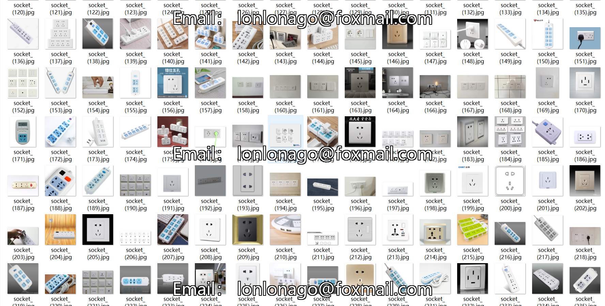
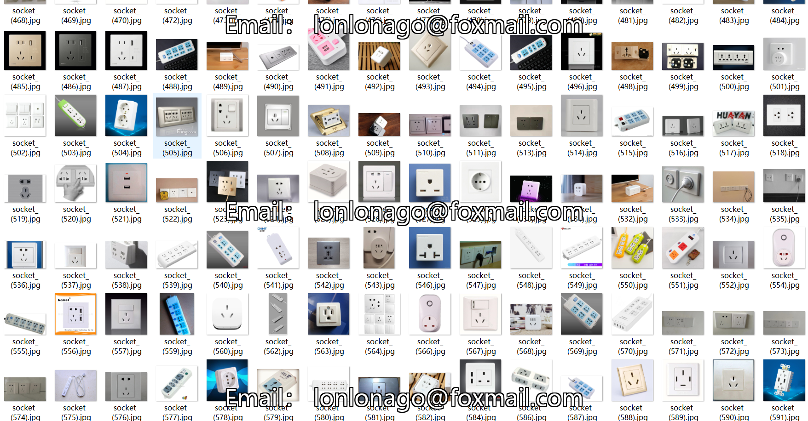

# SOCKET Dataset 821 imagesVOC+YOLO format

The dataset contains 821 images in VOC+YOLO format (annotated after web crawling)

Dataset format: Pascal VOC format + YOLO format (the txt file does not contain the split path, it only contains jpg images and corresponding VOC format xml files and yolo format txt files)

Number of images (total jpg file count): 821

Number of xml files: 821

Number of TXT files: 821

Number of categories: 1

The Github repository is: datasets_sl

Annotation class names: ["socket"]

Number of boxes labeled in each category:

Socket Frame Count = 1165

Total frames: 1165

Number of images per category:

The number of sockets occupied by images is 821.

Resolution of the image: Multi-resolution images, such as 667x500, 889x500, etc.

Use the labeling tool: labelImg

Dataset Augmentation: No

Rules for annotation: Draw a rectangle around the category.

Important note: The dataset does not have been divided into training, validation, and testing sets.

Special Disclaimer: This dataset does not guarantee the accuracy of the trained models or weight files.

Annotation and image details are as follows:

## Images

---

Here is a pay link on Stripe (https://buy.stripe.com/3cs8yP7sY87d0vu9AB). Please contact me lonlonago@foxmail.com after funding $89, and I will send you a complete data files, thank you!

